# imageRecognition
## 虚假人脸识别

### 原理

  ResNet-18是一种经典的CNN网络，是 Deep Residual Learning 团队在 2017 年提出的。它是为了解决 ImageNet 数据集上的图像分类任务而设计的，是目前最先进的图像分类模型之一。  ResNet-18 具有 18 个卷积层和 6 个全连接层，与传统的卷积神经网络相比，它在深度和广度上都有更高的分辨率和更好的性能。具体来说，它具有更大的池化层、更多的嵌入层和更密集的全连接层，可以捕捉更多的特征信息。  残差网络的核心思想是：每个附加层都应该更容易地包含原始函数作为其元素之一  ResNet沿用了VGG完整的3×3卷积层设计。 残差块里首先有2个有相同输出通道数的3×3卷积层。 每个卷积层后接一个批量规范化层和ReLU激活函数。 然后我们通过跨层数据通路，跳过这2个卷积运算，将输入直接加在最后的ReLU激活函数前。 这样的设计要求2个卷积层的输出与输入形状一样，从而使它们可以相加。 如果想改变通道数，就需要引入一个额外的1×1卷积层来将输入变换成需要的形状后再做相加运算。  

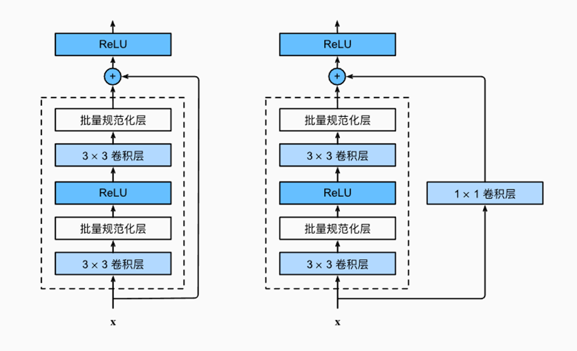

  在它的训练过程采用了一种称为“无损编码”的技术，可以减少传输数据的量，从而提高效率和性能。相对于之前的图像分类网络，ResNet-18 在性能、分辨率、参数数量和泛化性能方面表现出色，特别适合处理大规模图像数据集和复杂的分类任务。  

因此我们将实验数据集按照实验要求进行分类和划分后，训练一个ResNet-18网络 ，再用验证集进行测试。

### 步骤

#### **数据集划分**  

对数据进行清洗和预处理后，将其中 500 张真实人脸和 500 张虚假人脸作为训练集，其余作为测试集  

```python
from __future__ import print_function, division
import os
import random,shutil
# 给定一个人脸数据集，其中包含1999张真实人脸，1999张虚假人脸。
# 将其中500张真实人脸和500张虚假人脸作为训练集，其余作为测试集

#数据路径
# real_face_path='./CNN_synth_testset/0_real'
# fake_face_path='./CNN_synth_testset/1_fake'
face_dataset_path='./CNN_synth_testset'

#获取文件夹下所有文件名
def listDir(path):
    file_list=os.listdir(path)
    return file_list
#创建文件夹
def mkdir(path):
    if not os.path.exists(path):
        os.makedirs(path)

#划分训练集和测试集和验证集
divided_data_path='./face_data_divided/'
def datasetDivide(divide_path):
    # 读取真实人脸和虚假人脸数据路径
    path=os.listdir(face_dataset_path)
    for doc in path:
        data=os.listdir(os.path.join(face_dataset_path,doc))
        #将人脸数据清洗
        random.shuffle(data)
        train_face_data=data[:500]
        valid_face_data=data[500:1999]
        # test_face_data=[]#
        mkdir(divide_path+'train/'+doc+'/')
        mkdir(divide_path+'validation/'+doc+'/')
        # mkdir(divide_path+'test/'+doc+'/')
        for train_face in train_face_data:
            shutil.copy(os.path.join(face_dataset_path,doc,train_face),
                        divide_path+'train/'+doc+'/'+train_face)
            
        for valid_face in valid_face_data:
            shutil.copy(os.path.join(face_dataset_path,doc,valid_face),
                        divide_path+'validation/'+doc+'/'+valid_face)
            
    print('数据集划分完成')
    
datasetDivide(divided_data_path)

```

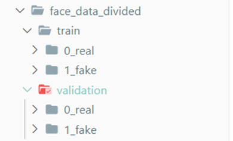

#### **数据预处理和超参数设置**

```python
超参数设置
import torch
import torchvision
import torch.nn as nn
import torch.optim as optim
from torchvision import datasets, models, transforms
import torch.backends.cudnn as cudnn
import numpy as np
import os

# 超参数
learning_rate = 0.001
batch_size = 4
num_epochs = 20

cudnn.benchmark = True#加速卷积神经网络的训练

数据集预处理
# 数据预处理——数据增强
data_transforms = {
    'train': transforms.Compose([
        transforms.RandomHorizontalFlip(),  # 随机水平翻转
        transforms.RandomCrop(224),  # 随机裁剪
        transforms.ToTensor(),  # 转换为张量
        transforms.Normalize([0.485, 0.456, 0.406], [0.229, 0.224, 0.225])  # 归一化
    ]),
    'validation': transforms.Compose([
        transforms.Resize(256),  # 缩放为256×256
        transforms.CenterCrop(224),  # 中心裁剪为224×224
        transforms.ToTensor(),  # 转换为张量，且值缩放到[0,1]
        transforms.Normalize([0.485, 0.456, 0.406], [0.229, 0.224, 0.225])  # 归一化
    ]),
}

#加载数据集
data_path=divided_data_path
image_datasets = {x: datasets.ImageFolder(os.path.join(divided_data_path, x),
                                            data_transforms[x])
                    for x in ['train', 'validation']}
# print(image_datasets)
#数据的批量加载
#num_workers=0表示单线程，因为在windows不支持多线程
dataloaders = {x: torch.utils.data.DataLoader(image_datasets[x], batch_size=batch_size,shuffle=True, num_workers=0)
                for x in ['train', 'validation']}
#数据集大小
dataset_sizes = {x: len(image_datasets[x]) for x in ['train', 'validation']}
# print(dataset_sizes)
#类别名称
class_names = image_datasets['train'].classes
# print(class_names)
#GPU是否可用
device=torch.device("cuda:0" if torch.cuda.is_available() else "cpu")
print(device)

```

####   **数据集可视化**

```python
import matplotlib.pyplot as plt
import numpy as np

# Get a batch of training data
inputs, classes = next(iter(dataloaders['train']))

def plot_images(images, labels, preds=None):
    """
    Plot a batch of images with their labels and predictions (if given).

    Args:
        images (tensor): A batch of images.
        labels (tensor): The true labels for each image.
        preds (tensor, optional): The predicted labels for each image. Defaults to None.
    """
    # Set up the figures
    num_images = len(images)
    cnt=0
    plt.figure(figsize=(16, 16))
    # Plot each image
    for i in range(num_images):
        cnt+=1
        plt.subplot(1, num_images, cnt)
        plt.xticks([], [])#设置x轴刻度
        plt.yticks([], [])#设置y轴刻度
        # Set the title
        if preds is not None:
            title = f"predicted: {class_names[preds[i]]}, true: {class_names[labels[i]]}\n"
            color = 'green' if preds[i] == labels[i] else 'red'
        else:
            title = f"{class_names[labels[i]]}\n"
            color = 'green'        
        plt.title(title, color=color)
        # Unnormalize the image
        image = images[i].numpy().transpose((1, 2, 0))
        mean = np.array([0.485, 0.456, 0.406])
        std = np.array([0.229, 0.224, 0.225])
        image = std * image + mean
        image = np.clip(image, 0, 1)
        plt.imshow(image)
        

    plt.show()

plot_images(inputs, classes)

```

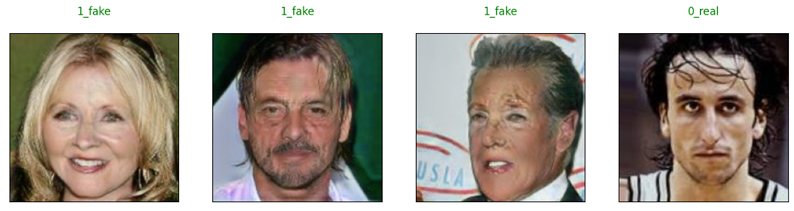

####   **模型构建及训练**

  我们定义了一个train_model函数，用于训练神经网络模型。函数接收模型（model）、损失函数（criterion）、优化器（optimizer）、学习率调整器（scheduler）和训练的轮数（num_epochs）作为参数，在该函数内部，进行模型的训练和验证，并记录训练和验证损失（loss）和准确率（accuracy）。其中我们使用tqdm库来包装我们的训练参数epoch,来显示进度条。  在训练过程我们使用了预训练模型、交叉熵损失函数、随机梯度下降法优化器以及学习率调整器，通过训练和验证来调整模型参数，最终得到一个表现较好的模型。  

```python
from tqdm import tqdm
from torch.optim import lr_scheduler
import copy,time
def train_model(model, criterion, optimizer,scheduler,num_epochs=25):
    best_model_wts = copy.deepcopy(model.state_dict())
    best_acc = 0.0
    
    start_time = time.time()
    train_loss_history = []
    train_acc_history = []
    val_loss_history = []
    val_acc_history = []
    
    pbar=tqdm(range(num_epochs))
    for epoch in pbar:
        print(f'Epoch {epoch+1}/{num_epochs}\n{"-"*10}')
        
        # 每个 epoch 都有一个培训和验证阶段
        for phase in ['train', 'validation']:
            if phase == 'train':
                model.train()  # 将模型设置为训练模式
            else:
                model.eval()   # 将模型设置为评估模式
            
            running_loss = 0.0#记录损失
            running_corrects = 0#记录正确的个数
            
            # 包装器tqdm，用于显示进度条
            # data_loader = tqdm(dataloaders[phase], desc=f'{phase} {epoch+1}/{num_epochs}')
            
            # 迭代数据
            for inputs, labels in  dataloaders[phase]:
                inputs = inputs.to(device)
                labels = labels.to(device)

                # 清零参数梯度
                optimizer.zero_grad()

                # 前向传递
                # track history if only in train
                with torch.set_grad_enabled(phase == 'train'):
                    outputs = model(inputs)
                    _, preds = torch.max(outputs, 1)
                    loss = criterion(outputs, labels)

                    # 只有在训练阶段才进行反向传递+优化
                    # backward + optimize only if in training phase
                    if phase == 'train':
                        loss.backward()
                        optimizer.step()

                # statistics
                running_loss += loss.item() * inputs.size(0)
                running_corrects += torch.sum(preds == labels.data)
            
            # 更新学习率
            epoch_loss = running_loss / len(dataloaders[phase].dataset)
            epoch_acc = running_corrects.double() / len(dataloaders[phase].dataset)
            
            if phase == 'train':
                train_loss_history.append(epoch_loss)
                train_acc_history.append(epoch_acc)
                scheduler.step()#对优化器的学习率进行调整
            else:
                val_loss_history.append(epoch_loss)
                val_acc_history.append(epoch_acc)
                
            # print(f'{phase} loss: {epoch_loss:.4f}, acc: {epoch_acc:.4f}')
            
            pbar.set_postfix_str(f'{phase} loss: {epoch_loss:.4f}, acc: {epoch_acc:.4f}')
            # deep copy the model
            if phase == 'validation' and epoch_acc > best_acc:
                best_acc = epoch_acc
                best_model_wts = copy.deepcopy(model.state_dict())
                
    
    time_elapsed = time.time() - start_time
    print(f'Training complete in {time_elapsed // 60:.0f}m {time_elapsed % 60:.0f}s')
    print(f'Best validation accuracy: {best_acc:.4f}')
    
    # 加载最佳模型权重
    model.load_state_dict(best_model_wts)

    return model, train_loss_history, train_acc_history, val_loss_history, val_acc_history

#加载预训练模型
model_ft = models.resnet18(pretrained=True)

#替换最后一层的分类器
#数据集只有两个类别（真实人脸和虚假人脸），因此新的全连接层的输出维度为2。
num_features=model_ft.fc.in_features
model_ft.fc=nn.Linear(num_features,len(class_names))

#定义损失函数和优化器
model_ft=model_ft.to(device)
criterion=nn.CrossEntropyLoss()
optimizer=optim.SGD(model_ft.parameters(),lr=learning_rate,momentum=0.9)

#学习率调整器
exp_lr_scheduler=lr_scheduler.StepLR(optimizer,step_size=7,gamma=0.1)

#训练模型
model_ft, train_loss_history, train_acc_history, val_loss_history, val_acc_history = train_model(model_ft, criterion, optimizer, exp_lr_scheduler, num_epochs=15)

```


#### **训练过程及结果可视化**

```python
#可视化训练过程
def plot_history(train_loss_history, train_acc_history, val_loss_history, val_acc_history):
    plt.figure(figsize=(15, 5))
    plt.subplot(121)
    plt.plot(train_loss_history, label='train')
    plt.plot(val_loss_history, label='validation')
    plt.xlabel('Epoch')
    plt.ylabel('Loss')
    plt.legend()
    plt.show()
    # plt.figure(figsize=(15, 5))
    # plt.subplot(122)
    # plt.plot(train_acc_history, label='train')
    # plt.plot(val_acc_history, label='validation')
    # plt.xlabel('Epoch')
    # plt.ylabel('Accuracy')
    # plt.legend()
    # plt.show()
    
    

def visualize_model(model, num_images=8):
    was_training = model.training
    model.eval()
    images_so_far = 0

    with torch.no_grad():
        for i, (inputs, labels) in enumerate(dataloaders['validation']):
            inputs = inputs.to(device)
            labels = labels.to(device)

            outputs = model(inputs)
            _, preds = torch.max(outputs, 1)

            plot_images(inputs.cpu(), preds, labels)
            images_so_far += batch_size

            if images_so_far == num_images:
                model.train(mode=was_training)
                return
        model.train(mode=was_training)
        
visualize_model(model_ft)
```

plot_history(train_loss_history, train_acc_history, val_loss_history, val_acc_history)
主要涉及两个函数，一个是用于可视化训练过程的 plot_history() 函数，另一个是用于可视化模型的 visualize_model() 函数。
plot_history() 函数接受四个参数，分别是训练损失、训练精度、验证损失和验证精度的历史记录。该函数会将训练和验证损失随着训练轮数的增加而变化的曲线绘制在同一张图上进行对比，以便于分析模型的训练效果。最后通过 plt.show() 函数将图像展示出来。
visualize_model() 函数接受两个参数，一个是模型对象，另一个是要可视化的图片数目，默认为 8。该函数会将模型在验证集上的预测结果可视化出来。具体实现是通过一个循环遍历验证集数据集中的图片，然后将这些图片、模型的预测结果以及真实标签传递给 plot_images() 函数进行展示。在展示完指定数量的图片之后，该函数会将模型的模式切换回之前的模式，即训练模式或评估模式。
通过调用 visualize_model() 函数和 plot_history() 函数，可视化了模型的预测结果和训练过程。

**训练过程**

  首先分析在6个Epoch内，我们看到Loss函数收敛到接近于零，无论是训练的loss还是验证集的loss,验证集上的正确率达到了100%，时间花费在14分钟左右，在GPU上进行训练  

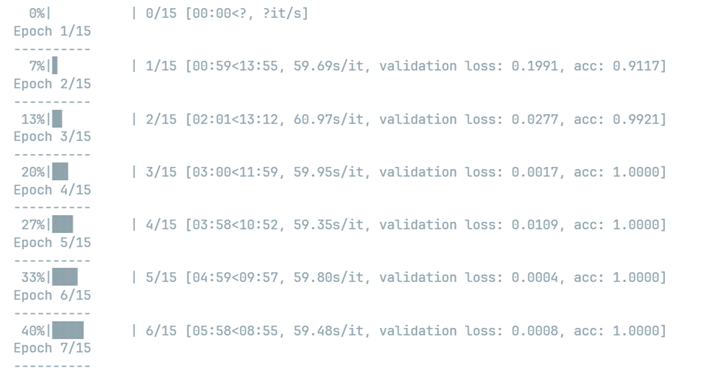

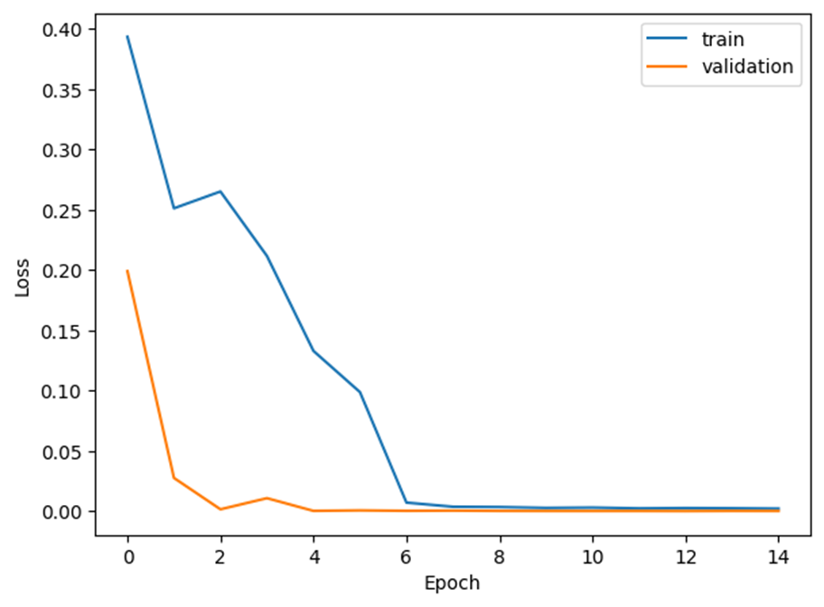

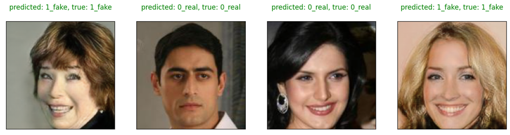

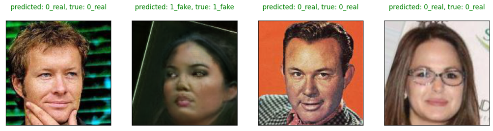


## 手写四则运算识别

> 训练数据是在MNIST 数据集上，扩充了“ “＋ 、-、×、÷、（、）” 6种符号数据集，我们称之为“MNIST +”数据集。每种样本以png图片格式保存在一个文件夹中，总共16个种类，每种含5000张以上图像样本。
>
> 总共100张测试样本图片，存储在test文件夹下。

下面我用LSTM来识别经过扩充后的手写数据集

**1)** 读取图片数据集；

我们通过listdir列举出数据集下路径下的文件夹，文件夹下有相对应的类别名和它下面的文件，我们可以把这个作为图片的标签，从而创建数据集。

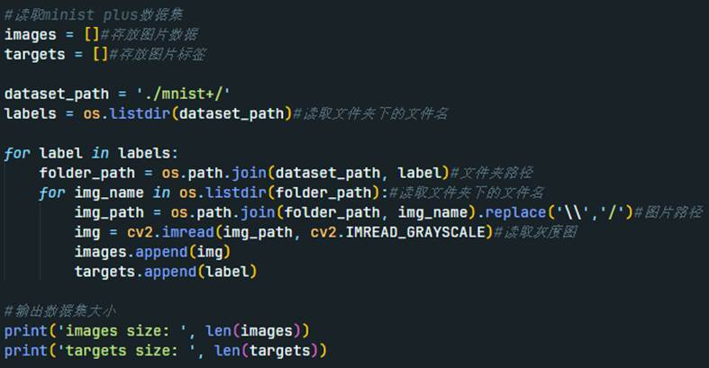

由于在训练过程发现模型的泛化能力不是很高，因此做了一些数据集的扩充，主要是做翻转操作

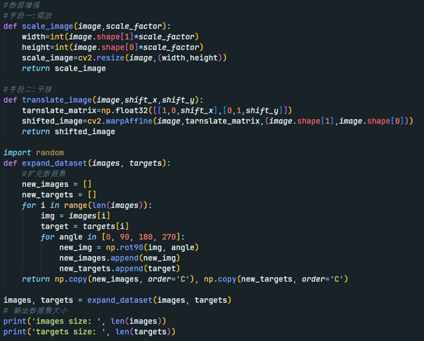

然后为了方便数据集的处理，我定义了一个自定义数据集，并用transform进行处理

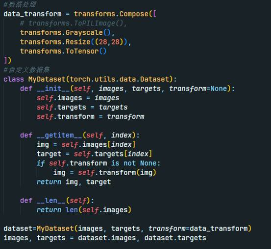

接下来我们需要用train_test_split来划分训练集或者测试集(也可以把它当作验证集),batchsize这里设置的是40

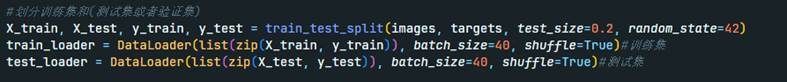

**2)** 创建深度神经网络模型；

先定义LSTM模型的结构

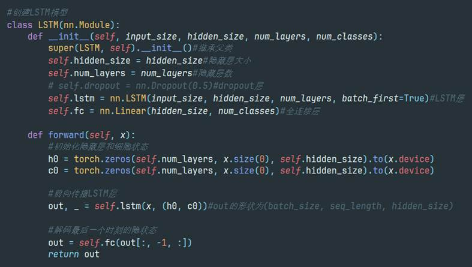

设置模型超参数，和模型的具体参数

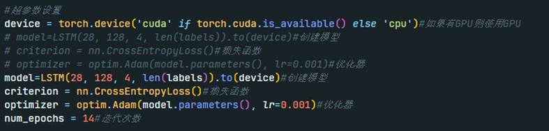

**3)** 训练模型；

 

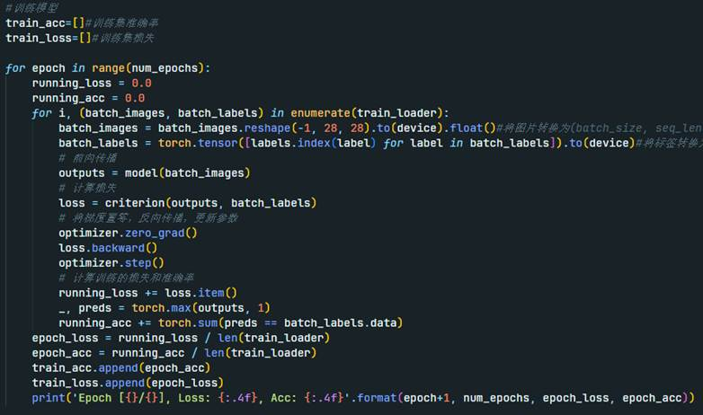

模型训练输出过程

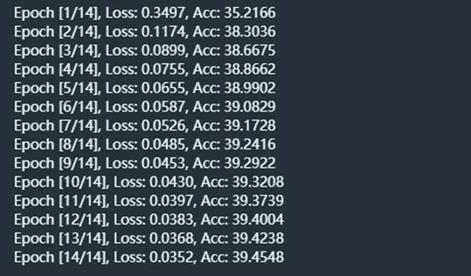

可以绘制我们每个轮次的损失

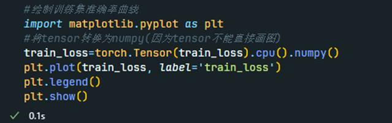

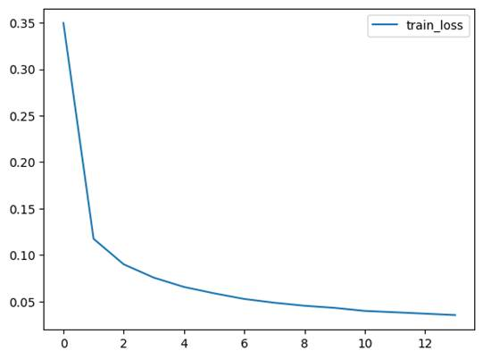

**4)** 测试模型；

在测试集上测试模型，并保存模型

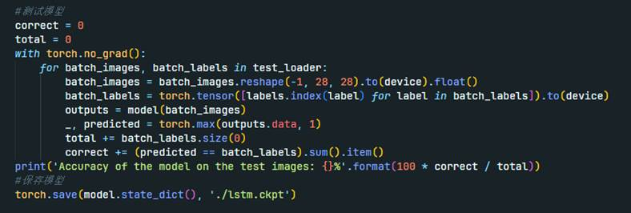

**5)** 输出测试精度。

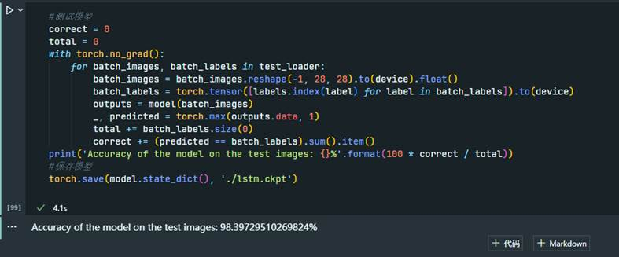

**1.** **以手写四则运算图片（白底黑字）为输入，完成：**

**1)** 使用连通域提取或者其它方法裁剪出图像中的每一个字符；

首先我们使用连通域提取方法，结果如下发现效果不是很理想，断点太多

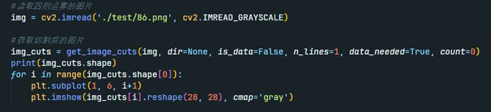

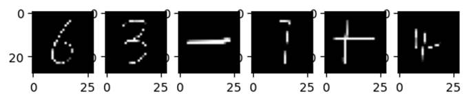

因此我们换成了边缘检测切割

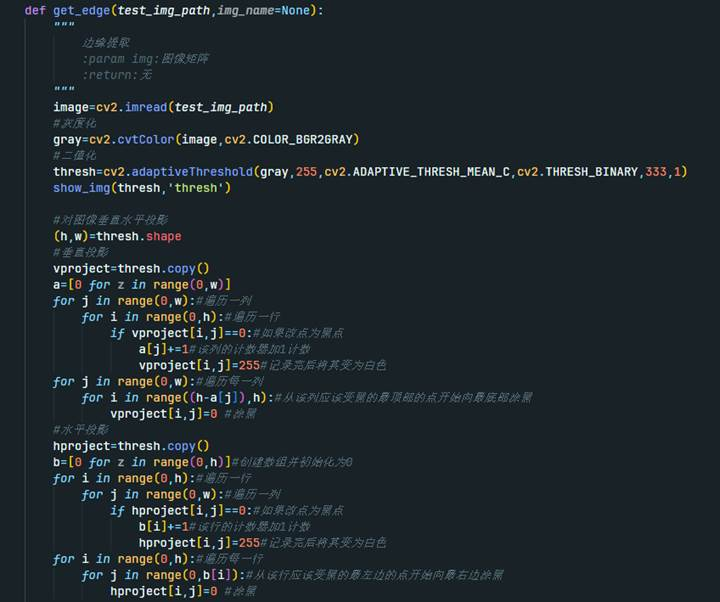

可以输出水平和垂直投影的直方图如下

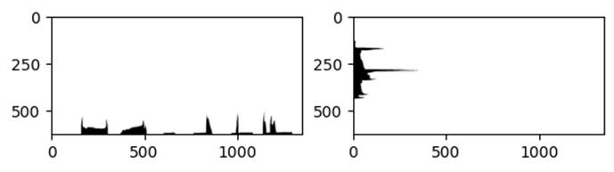

然后可以通过投影来获取分割图像坐标

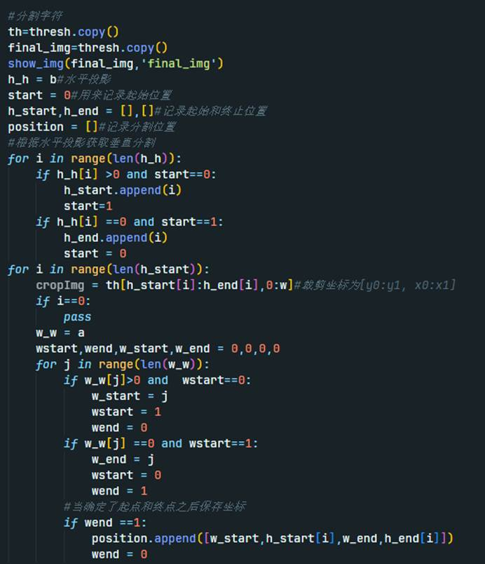

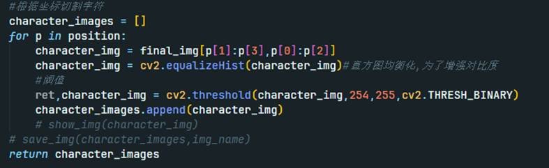

由于是从边缘切割，因此我们可以加上周围的留白，更好看一些

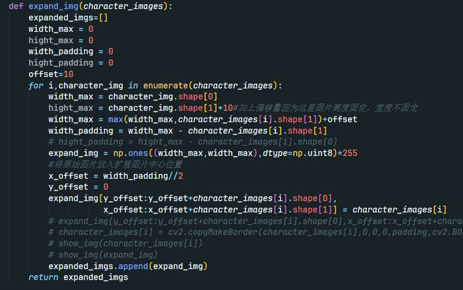

可以看到边缘检测切割的效果很好

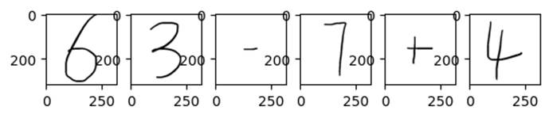

 

**2)** 调整字符图片大小为28*28像素；

写好预测函数，并将输入图片调整为28*28像素

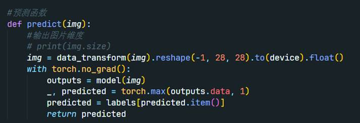

**3)** 输入深度神经网络，识别图片中的所有字符，并输出识别结果；

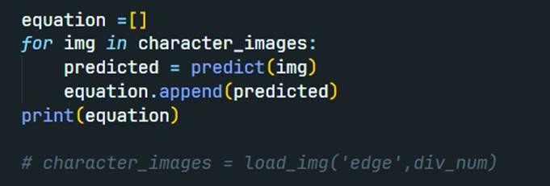

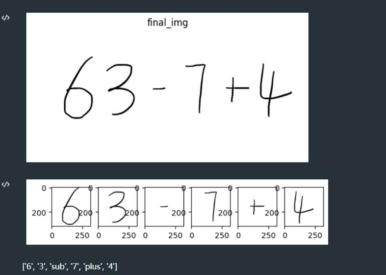

**4)** 输出图片中算式计算结果。

计算方法

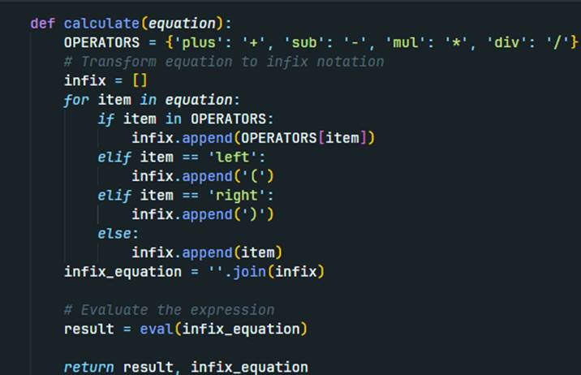

**实例**： 

**输入图片：**

*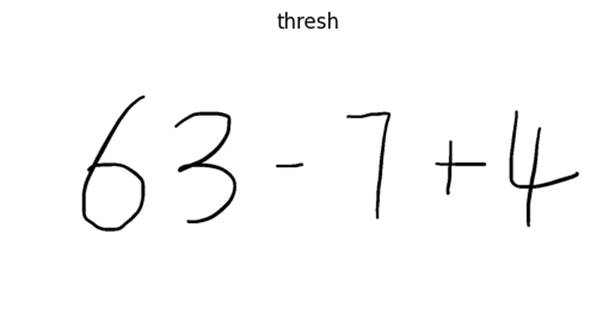*

**输出结果：**

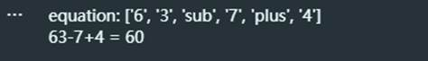
